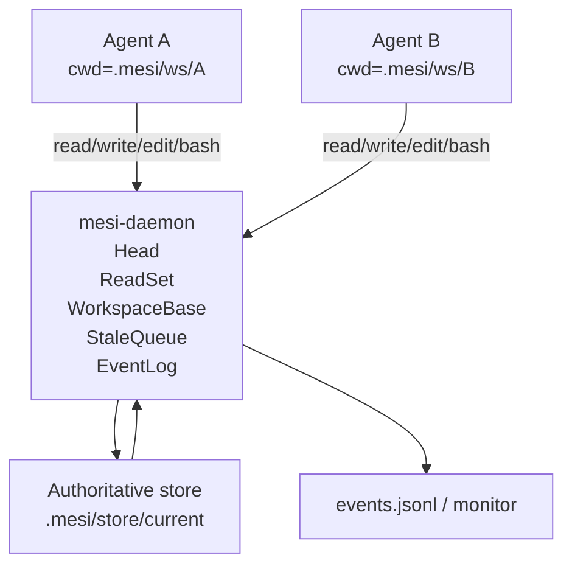

# MESI Workspace Runtime Requirements

## Problem Frame

Context-MESI needs a first implementation that proves agent context coherence without requiring an OS-level virtual filesystem. The core experiment is not syscall transparency. It is whether multiple coding agents can work in ordinary directories while a runtime tracks which artifact versions each agent has read, marks old context as stale when another agent advances an authoritative version, blocks writes from stale agents, and lets them recover through refresh.

The runtime should validate append-only context coherence: once old content has entered an agent's context it cannot be removed, but the system can logically demote it from authoritative context and prevent writes that would continue from that stale basis.

## High-Level Direction

The first version should be a materialized workspace runtime, not a FUSE filesystem. Each agent receives a real workspace directory. A daemon owns the authoritative backing store, version metadata, stale tracking, and event log. Tool wrappers mediate ordinary read, write, edit, patch, refresh, status, and bash operations.

## Requirements

**Runtime Model**
- R1. The MVP must run on macOS and Linux without FUSE, kernel extensions, special mounts, or elevated filesystem permissions.
- R2. Each agent must operate inside its own ordinary materialized workspace directory, separate from the authoritative backing store and from other agents' workspaces.
- R3. The runtime must maintain an authoritative current view of project files, a per-path current version, per-agent read versions, per-agent workspace base versions, per-agent unresolved stale notices, and an append-only event log.
- R4. The MVP must use file-level coherence and a strict stale policy: if an agent has any unresolved stale notice, all write-producing operations for that agent are blocked until refresh resolves the stale state.
- R5. Managed paths must be project-relative file paths. Runtime metadata and workspace internals, including `.mesi`, must be excluded from managed file snapshots and coherence commits.

**Read and Refresh Semantics**
- R6. A mediated read of an existing path must copy the current authoritative file into the requesting agent's workspace, record that the agent read the current version, record the workspace base for that path, emit a read event, and return the file content.
- R7. A mediated read of a missing path must return a clear not-found result, record the path's current version as an explicit absent version, and allow later creation to pass the normal workspace-base check if the authoritative head remains absent.
- R8. A mediated refresh must update the agent workspace from the authoritative store for the requested stale path or paths, update workspace base versions, clear resolved stale notices, and emit refresh events.
- R9. A read of the latest authoritative version of a stale path must be allowed to resolve the stale notice for that path.

**Write Semantics**
- R10. A mediated write, edit, or patch must be rejected if the agent has any unresolved stale notice.
- R11. A mediated write, edit, or patch must be rejected if the workspace base version for the target path does not match the authoritative head version for that path.
- R12. The version model must support an explicit absent version so new file creation can be treated as a normal `absent -> hash` transition.
- R13. A successful mediated write must update both the agent workspace and the authoritative store, advance the path head, update the writing agent's read and workspace-base versions for that path, emit a write event, and enqueue stale notices for other agents that read the previous version.
- R14. The MVP must make blocked writes visible to the agent and monitor with a concrete reason, including unresolved stale notices or workspace-base mismatch.

**Bash Semantics**
- R15. The bash wrapper must reject commands before execution when the agent has unresolved stale notices.
- R16. The bash wrapper must run allowed commands in the agent's materialized workspace, take a pre/post file hash snapshot, compute changed files, and submit observed writes through the same stale and workspace-base checks used by mediated writes.
- R17. If a bash command changes a file whose workspace base is no longer current, the runtime must not advance the authoritative store for that file and must emit a dirty-conflict or observed-write-blocked event.
- R18. The MVP does not need to track shell read semantics; bash read visibility is outside the first-version guarantee.

**Agent Tooling**
- R19. The project must provide opencode-compatible custom tools for read, write, edit, apply_patch, bash, MESI status, and MESI refresh.
- R20. Tool behavior must make coherence state understandable to agents: status must expose unresolved stale notices, blocked reasons, and the refresh action needed to recover.
- R21. Tool wrappers must be the supported integration path for the MVP; direct filesystem access outside wrappers is treated as out of scope rather than silently supported.

**Runtime Control Surface**
- R22. The runtime must provide a minimal CLI or equivalent control surface to initialize MESI state for a project, create named agent workspaces, and start a live monitor.
- R23. The daemon/tool boundary must support read, write, refresh, stale-status, bash begin/end or equivalent observed-write submission, and event retrieval operations.
- R24. The exact transport between tools and daemon is deferred to planning, but it must be local-first and simple enough for deterministic demos.

**Monitoring and Traceability**
- R25. Every coherence-relevant operation must emit structured events suitable for both JSONL storage and live terminal monitoring.
- R26. The monitor must show the complete causal trace for read, write, stale, blocked write, refresh, bash observed write, and conflict events.
- R27. Event output must be clear enough to verify demo scenarios without inspecting internal state manually.

**Demo Scenarios**
- R28. The MVP must include a basic stale demo where Agent A reads a file, Agent B writes the same file, Agent A becomes stale, Agent A's later write is blocked, Agent A refreshes, and Agent A can write again.
- R29. The MVP must include a bash observed-write demo where a bash command mutates a file, the runtime detects the changed file by snapshot diff, advances the authoritative version, and marks other agents that read the old version as stale.
- R30. The MVP must include a workspace-base mismatch demo where an agent attempts to submit a local file based on an old materialized version and the runtime blocks the commit.

## Success Criteria

- Two opencode sessions can run against separate ordinary workspace directories on macOS or Linux.
- The runtime can reproduce the expected trace: `READ file@h1`, `WRITE file h1 -> h2`, `STALE other-agent file h1 -> h2`, `WRITE BLOCKED unresolved_stale`, `REFRESH file@h2`, and a later successful write.
- Bash-produced file mutations are detected by pre/post diff and submitted through the same coherence checks as wrapper writes.
- A stale agent cannot advance any authoritative file until its stale notices are resolved.
- The monitor provides enough information to explain why each write succeeded, blocked, or became a conflict.
- The implementation demonstrates the Context-MESI experiment without requiring FUSE or syscall-level read/write interception.

## Scope Boundaries

- The MVP will not implement an OS-level filesystem, FUSE mount, kernel integration, or transparent syscall interception.
- The MVP will not guarantee capture of all reads performed inside shell commands, editors, LSPs, or background processes.
- The MVP will not prevent an agent or human from bypassing wrappers and directly accessing the authoritative store or another agent workspace.
- The MVP will not infer whether a write semantically depends on a stale file; strict file-level stale blocking is the intentional first-version policy.
- The MVP will not attempt full delete semantics unless planning determines deletion is needed for the demo; new file creation is required, deletion can be deferred.
- The MVP will not attempt automatic three-way merge, rollback, or conflict patch preservation unless needed for a minimal dirty-conflict marker.
- Git worktrees, Git diff/status, and file watchers may be used later as implementation optimizations, but the first protocol must not depend on them.

## Key Decisions

- Use materialized workspaces instead of FUSE: This keeps installation simple, cross-platform, and focused on protocol verification rather than filesystem transparency.
- Make the daemon authoritative: A single runtime owner for heads, read sets, workspace bases, stale notices, and events keeps coherence behavior inspectable.
- Treat read as local refresh: Reading a path materializes the current authoritative version into the agent workspace and gives the daemon a precise version record.
- Require workspace-base checks: An agent can hold an old local file even if it never explicitly read it during the current turn, so write admission must compare the local base against the current head.
- Adopt strict stale blocking for the MVP: Blocking all writes while any stale notice is unresolved is conservative, easy to explain, and sufficient to prove the core coherence chain.
- Use pre/post snapshot diff for bash: This avoids syscall interception while still observing write effects from shell commands.
- Keep watchers out of the coherence core: Watchers may help monitor local changes, but they should not advance authoritative state automatically.

## Alternatives Considered

- FUSE virtual filesystem: Rejected for the MVP because it optimizes for syscall transparency while adding installation, permission, platform, and implementation complexity that is not required to prove the coherence protocol.
- Git worktrees as the primary model: Deferred because they are promising for code repositories but would bind the protocol to Git too early. Git may still be useful later for diff, rollback, and conflict handling.
- File watcher driven commits: Rejected as the coherence core because watcher events can be duplicated, coalesced, or arrive while a file is only partially written. Watchers remain useful for monitor/debug support.
- Plain copy workspaces: Chosen for the first version because they are simple, portable, and make daemon-owned coherence decisions explicit.

## Dependencies / Assumptions

- opencode custom tools can override or wrap read, write, edit, apply_patch, and bash behavior for the target sessions.
- Agents are launched with their working directory set to their assigned materialized workspace.
- Version identity can be represented by stable content hashes for MVP purposes.
- The project can start with ordinary copy-based workspaces; Git integration can be evaluated after the protocol is proven.

## Outstanding Questions

### Resolve Before Planning

- None.

### Deferred to Planning

- [Affects R3][Technical] Should runtime state begin as a small SQLite database, an in-memory daemon with JSON snapshots, or another lightweight persistence format?
- [Affects R16][Technical] What files should snapshot diff ignore by default beyond `.mesi`, such as `.git`, dependency folders, build output, or temporary files?
- [Affects R19][Needs research] What exact opencode tool API shape should the custom tools use for the currently installed opencode version?
- [Affects R28][Technical] Should demos be implemented as shell scripts, integration tests, recorded fixtures, or a small CLI demo runner?

## Next Steps

-> `/ce:plan` for structured implementation planning.
